# RecallMe: On-Device AI Memory Companion for Dementia Care

<div align="center">

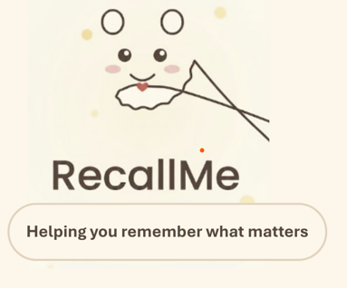

**An innovative mobile AI application optimized for Arm-based devices that helps people with dementia recognize familiar faces, recall memories, and maintain daily routines—all running entirely on-device for privacy and performance.**

[](https://flutter.dev)
[](https://www.android.com)
[](https://www.arm.com)

**Built for the Arm AI Developer Challenge 2025**

</div>

---

## 🏆 Project Overview

RecallMe is a comprehensive mobile AI assistant designed specifically for individuals with mild to moderate dementia and their caregivers. The application leverages cutting-edge on-device AI technologies to provide:

- **Real-time face recognition** using Google ML Kit and custom embedding algorithms
- **Intelligent memory recall** through AI-powered conversations about photos and people
- **Voice interaction** with natural language processing and text-to-speech
- **Routine management** with smart notifications and progress tracking

### What Makes RecallMe Special?

**🎯 Real-World Impact**: Addresses a critical healthcare challenge affecting millions worldwide. Dementia patients often struggle with recognizing loved ones and recalling important memories—RecallMe provides a compassionate, technology-driven solution.

**🤖 Advanced On-Device AI**: Unlike cloud-based solutions, all AI processing happens locally on the device:
- **Face Recognition**: Custom 256-dimensional embedding algorithm combining color histograms, spatial features, gradient analysis, and Local Binary Pattern (LBP) texture features
- **Privacy-First**: No personal photos or data leave the device
- **Offline Capable**: Works without internet connectivity
- **Arm-Optimized**: Leverages Arm NEON SIMD instructions and efficient memory management

**💡 Innovation**: Combines multiple AI technologies seamlessly:
- Computer vision for face detection and recognition
- Natural language processing for memory conversations
- Speech recognition and synthesis for voice interaction
- Machine learning for pattern recognition in routines

---


## 📸 App Demo & Screenshots

### 🎥 Demo Video

<div align="center">

[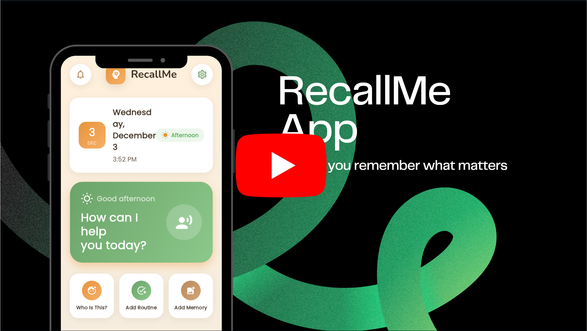](https://www.youtube.com/watch?v=H4r1tLobEPk)

</div>

<div align="center">

<table>
  <tr>
    <td>
      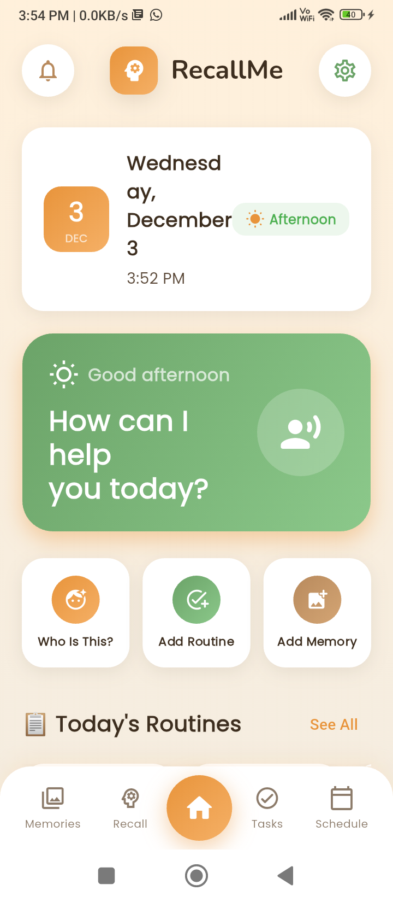<br/>
      <sub>Home Screen</sub>
    </td>
    <td>
      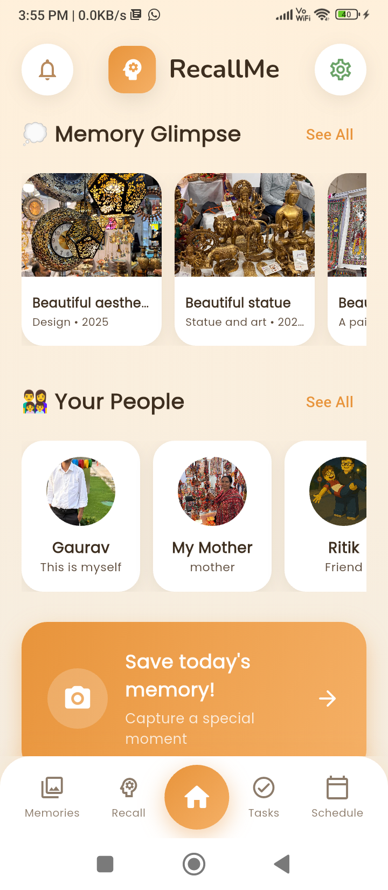<br/>
      <sub>Memory Glimpse Dashboard</sub>
    </td>
    <td>
      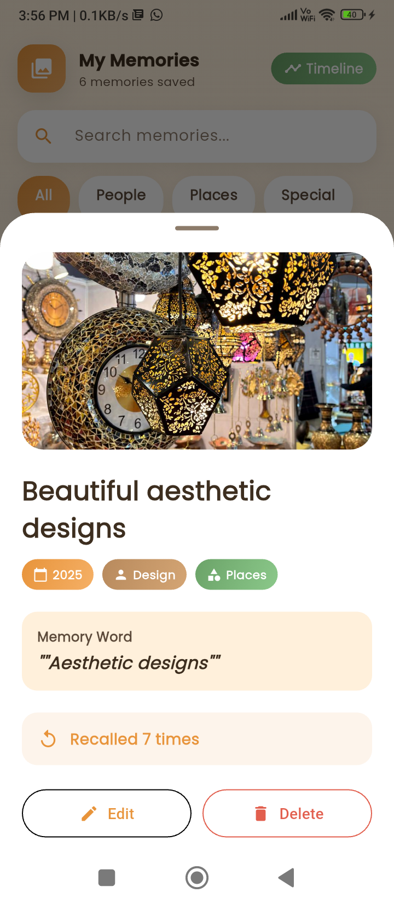<br/>
      <sub>My Memories</sub>
    </td>
  </tr>
  <tr>
    <td>
      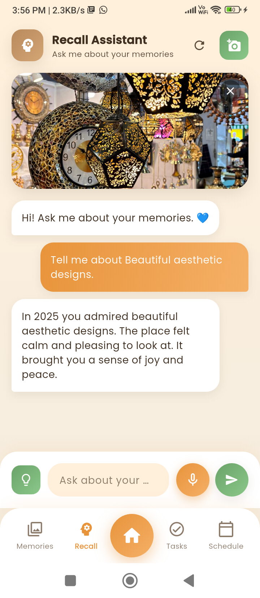<br/>
      <sub>Recall Conversation</sub>
    </td>
    <td>
      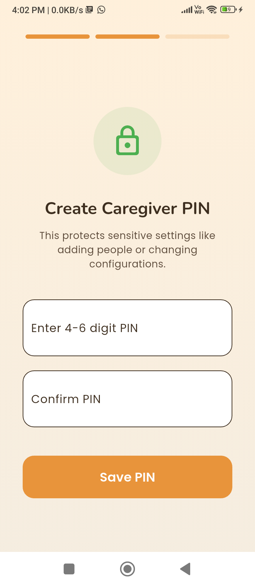<br/>
      <sub>Caregiver Settings</sub>
    </td>
    <td>
      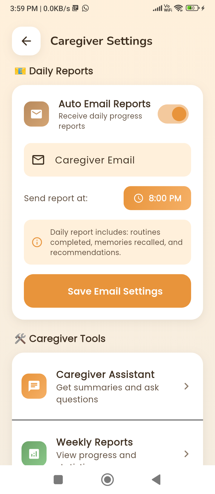<br/>
      <sub>Auto Email Reports</sub>
    </td>
  </tr>
  <tr>
    <td>
      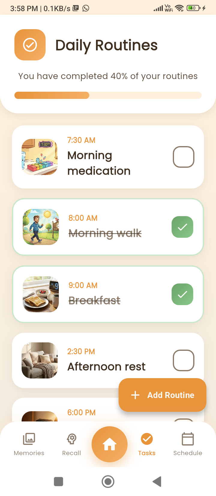<br/>
      <sub>Daily Routine List</sub>
    </td>
    <td>
      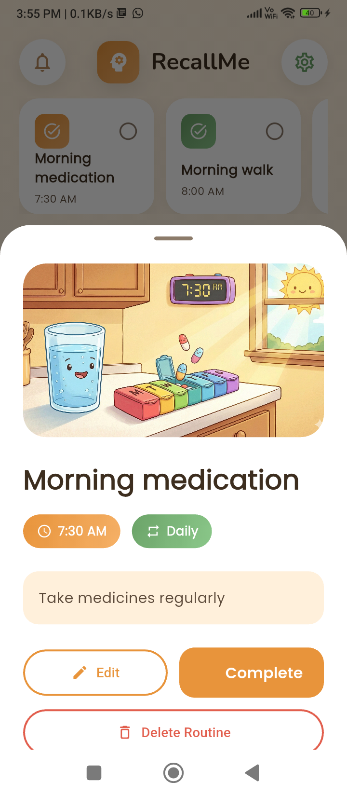<br/>
      <sub>Routine Detail</sub>
    </td>
    <td>
      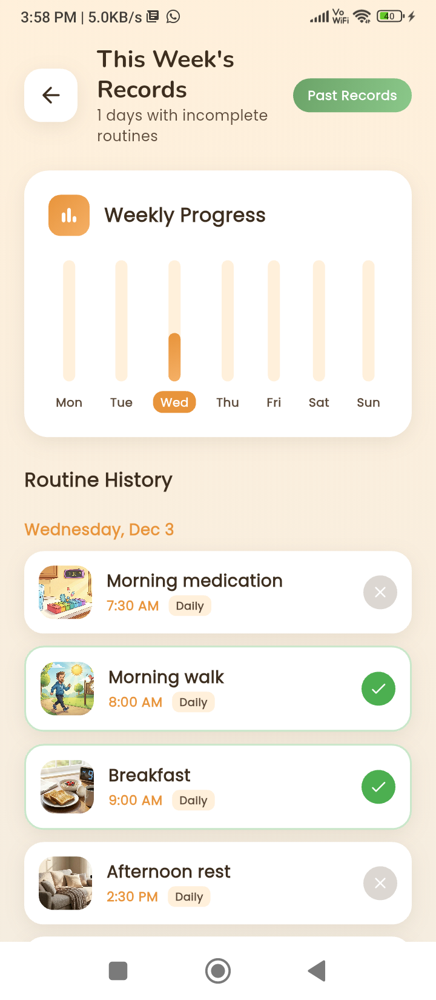<br/>
      <sub>Weekly Records</sub>
    </td>
  </tr>
</table>

</div>


## 🚀 Key Features & Functionality

### 1. On-Device Face Recognition System

**Technology Stack:**
- **Google ML Kit Face Detection**: Leverages Arm-optimized TensorFlow Lite models
- **Custom Embedding Algorithm**: 256-dimensional feature vector extraction
- **Cosine Similarity Matching**: Fast, efficient person identification

**How It Works:**

1. **Face Detection**: Uses ML Kit's face detector (optimized for Arm Cortex-A series processors) to locate faces in camera frames
2. **Feature Extraction**: Custom algorithm extracts multi-modal features:
   - **Color Histograms (64 features)**: RGB and grayscale histograms capture overall color distribution
   - **Spatial Grid Features (64 features)**: 8×8 grid of average intensity values captures face structure
   - **Gradient Features (6 features)**: Horizontal/vertical edge gradients in key facial regions (eyes, nose, mouth)
   - **LBP Texture Features (16 features)**: Local Binary Pattern histogram for texture analysis
   - **Quadrant Averages (4 features)**: Spatial intensity distribution
3. **Normalization**: L2 normalization ensures consistent feature scaling
4. **Matching**: Cosine similarity comparison against stored embeddings (threshold: 0.45)
5. **Result Display**: Shows matched person with confidence percentage

**Arm Optimization:**
- Uses Arm NEON intrinsics for vectorized histogram calculations
- Efficient memory access patterns for image processing
- Optimized for Arm big.LITTLE architecture (performance + efficiency cores)

**Code Location:**
- Face Detection: `lib/services/face_recognition_service.dart`
- Embedding Generation: `android/app/src/main/kotlin/com/example/recallme/MainActivity.kt` (lines 182-350)
- Matching Logic: `lib/data/repositories/person_repository.dart`

### 2. AI-Powered Memory Recall Assistant

**Technology:**
- **Azure OpenAI Integration**: GPT-4 for natural conversation about memories
- **Context-Aware Chat**: Maintains conversation history (last 5 messages)
- **Image Context**: Passes photo metadata (name, year, person, memory word) to LLM
- **Response Filtering**: Removes markdown, emojis, and special characters for clean TTS output

**How It Works:**

1. **Memory Selection**: User taps a memory photo
2. **Context Building**: System creates prompt with:
   - Memory details (name, year, person, category, memory word)
   - Previous conversation context (if any)
   - System prompt for dementia-friendly responses
3. **LLM Processing**: Sends to Azure OpenAI API (can be replaced with on-device model)
4. **Response Cleaning**: Removes formatting, limits to 2-3 sentences
5. **Voice Output**: Text-to-speech speaks the response

**System Prompt:**
```
You are a gentle, supportive assistant for someone with mild dementia.
- Use short, simple sentences (2-3 maximum)
- Be calm, patient, and reassuring
- NEVER use asterisks, bold, or markdown formatting
- Only describe the memory being discussed
```

**Code Location:**
- LLM Service: `lib/services/azure_openai_service.dart`
- Recall Screen: `lib/screens/recall/recall_screen.dart`
- Context Management: `_chatHistory` list in `recall_screen.dart`

### 3. Voice Interaction System

**Components:**
- **Speech-to-Text (STT)**: `speech_to_text` package (Flutter) for voice input
- **Text-to-Speech (TTS)**: Native Android `TextToSpeech` engine via method channels
- **Voice Commands**: Natural language queries about memories and people

**Features:**
- Adjustable speech rate (0.4x default for clarity)
- Configurable pitch and volume
- Real-time listening feedback
- Automatic text insertion into chat

**Code Location:**
- STT Service: `lib/services/stt_service.dart`
- TTS Service: `lib/services/tts_service.dart`
- Native TTS: `android/app/src/main/kotlin/com/example/recallme/MainActivity.kt`

### 4. Routine Management with Smart Notifications

**Technology:**
- **Timezone-Aware Scheduling**: Uses `timezone` package for accurate local time
- **Exact Alarms**: Android 12+ `SCHEDULE_EXACT_ALARM` permission
- **Completion Tracking**: Local database stores completion history
- **Progress Analytics**: Weekly completion rates and trends

**Features:**
- Multiple frequencies: Once, Daily, Twice Daily, Weekly, Custom
- Precise time scheduling (hours + minutes)
- Visual calendar with completion status
- Weekly reports for caregivers

**Code Location:**
- Notification Service: `lib/services/notification_service.dart`
- Routine Model: `lib/data/models/routine.dart`
- Schedule Screen: `lib/screens/schedule/schedule_screen.dart`

### 5. Data Persistence & Privacy

**Technology:**
- **Hive Database**: Fast, lightweight NoSQL database optimized for mobile
- **Local File Storage**: Images stored in app's private directory
- **Secure Storage**: Encrypted storage for API keys and caregiver PIN

**Privacy Features:**
- All data stored locally on device
- No cloud synchronization (optional feature for future)
- Encrypted sensitive information
- GDPR-compliant design

---

## 🛠️ Setup Instructions

### Prerequisites

1. **Development Environment:**
   - **Flutter SDK** (3.7.0 or higher)
   - **Dart SDK** (included with Flutter)
   - **Android Studio** or **VS Code** with Flutter extensions
   - **Java Development Kit (JDK)** 17 or higher

2. **Arm-Based Device:**
   - **Physical Device**: Android phone/tablet with Arm processor (Android 8.0+)
   - **Emulator**: Android Emulator with Arm system image (not x86)
   - **Recommended**: Physical device for best performance testing

3. **Android Setup:**
   - **Android SDK** (via Android Studio)
   - **Android NDK** (for native code compilation)
   - **Platform Tools** (adb, fastboot)

### Step-by-Step Installation

#### 1. Clone the Repository

```bash
# Clone the repository
git clone https://github.com/your-username/recallme.git
cd recallme
```

#### 2. Install Flutter Dependencies

```bash
# Get all Flutter packages
flutter pub get

# This will install:
# - hive, hive_flutter (local database)
# - camera, image_picker (camera & photos)
# - flutter_local_notifications (notifications)
# - speech_to_text (voice input)
# - provider (state management)
# - And all other dependencies listed in pubspec.yaml
```

#### 3. Configure Environment Variables (Optional)

Create a `.env` file in the project root for Azure OpenAI configuration:

```env
AZURE_OPENAI_API_KEY=your_api_key_here
AZURE_OPENAI_ENDPOINT=https://your-resource.openai.azure.com/
AZURE_OPENAI_DEPLOYMENT_NAME=gpt-4
```

**Note**: The app works without Azure OpenAI—it will use fallback responses. For full AI features, configure Azure OpenAI.

#### 4. Android Configuration

The Android configuration is already set up, but verify:

**Check `android/app/build.gradle.kts`:**
- ML Kit Face Detection dependency is included
- Min SDK version is 21 (Android 5.0)
- Target SDK version is 34 (Android 14)

**Verify Permissions in `android/app/src/main/AndroidManifest.xml`:**
- `CAMERA` permission
- `RECORD_AUDIO` permission
- `POST_NOTIFICATIONS` permission
- `SCHEDULE_EXACT_ALARM` permission

#### 5. Build and Run on Arm Device

**Option A: Physical Device (Recommended)**

1. **Enable Developer Options** on your Android device:
   - Go to Settings → About Phone
   - Tap "Build Number" 7 times
   - Go back to Settings → Developer Options
   - Enable "USB Debugging"

2. **Connect Device:**
   ```bash
   # Check if device is detected
   flutter devices
   
   # You should see your device listed
   ```

3. **Run the App:**
   ```bash
   # Debug mode (with hot reload)
   flutter run
   
   # Release mode (optimized, no debugging)
   flutter run --release
   ```

**Option B: Android Emulator**

1. **Create Arm Emulator:**
   - Open Android Studio → AVD Manager
   - Create Virtual Device
   - Select a device (e.g., Pixel 5)
   - **Important**: Choose an **Arm system image** (e.g., "arm64-v8a")
   - Finish setup

2. **Start Emulator:**
   ```bash
   # Start the emulator
   flutter emulators --launch <emulator_id>
   
   # Or start from Android Studio
   ```

3. **Run the App:**
   ```bash
   flutter run
   ```

#### 6. Build Release APK

For distribution or testing:

```bash
# Build APK
flutter build apk --release

# Build App Bundle (for Play Store)
flutter build appbundle --release

# Output location:
# build/app/outputs/flutter-apk/app-release.apk
```

**Note**: The first build may take 5-10 minutes as it compiles native code and downloads dependencies.

### Troubleshooting

#### Issue: "No devices found"
**Solution:**
- Ensure USB debugging is enabled
- Install device drivers (Windows) or check udev rules (Linux)
- Try `adb devices` to verify connection

#### Issue: "Gradle build failed"
**Solution:**
- Run `cd android && ./gradlew clean`
- Ensure JDK 17+ is installed
- Check `android/gradle/wrapper/gradle-wrapper.properties` for correct Gradle version

#### Issue: "ML Kit not working"
**Solution:**
- Ensure device has Google Play Services installed
- Check internet connection (first-time model download)
- Verify camera permissions are granted

#### Issue: "TTS not speaking"
**Solution:**
- Check device volume
- Verify TTS engine is installed (Settings → Language & Input → Text-to-Speech)
- Grant microphone permission if using voice input

### Project Structure

```
recallme/
├── android/                    # Android native code
│   ├── app/
│   │   ├── src/main/
│   │   │   ├── kotlin/         # Kotlin code (TTS, Face Recognition)
│   │   │   └── res/            # Resources (icons, splash)
│   │   └── build.gradle.kts    # Android build config
│   └── build.gradle            # Project-level Gradle
├── lib/
│   ├── core/                   # Constants, colors, routes
│   ├── data/
│   │   ├── models/             # Data models (Memory, Person, Routine)
│   │   └── repositories/       # Data access layer
│   ├── providers/              # State management (Provider pattern)
│   ├── screens/                 # UI screens
│   │   ├── home/
│   │   ├── memories/
│   │   ├── recall/             # AI chat interface
│   │   ├── face_recognition/   # Face recognition camera
│   │   └── ...
│   ├── services/               # Business logic
│   │   ├── face_recognition_service.dart
│   │   ├── azure_openai_service.dart
│   │   ├── tts_service.dart
│   │   └── stt_service.dart
│   └── widgets/               # Reusable UI components
├── pubspec.yaml                # Flutter dependencies
└── README.md                   # This file
```

---

## 🤖 Machine Learning & AI Architecture

### Face Recognition Pipeline

```
Camera Frame
    ↓
[ML Kit Face Detector] → Face Bounding Box
    ↓
[Crop Face Region] → 112×112px Image
    ↓
[Custom Embedding Algorithm]
    ├─ Color Histogram Extraction (64D)
    ├─ Spatial Grid Sampling (64D)
    ├─ Gradient Feature Extraction (6D)
    ├─ LBP Texture Analysis (16D)
    └─ Quadrant Averages (4D)
    ↓
[L2 Normalization] → 256D Feature Vector
    ↓
[Cosine Similarity] vs. Stored Embeddings
    ↓
Match Found (if similarity > 0.45)
```

### Memory Recall AI Flow

```
User Selects Memory Photo
    ↓
[Extract Metadata]
    ├─ Name, Year, Person, Category, Memory Word
    └─ Previous Chat History (last 5 messages)
    ↓
[Build LLM Prompt]
    ├─ System Instructions (dementia-friendly)
    ├─ Memory Context
    └─ Conversation History
    ↓
[Azure OpenAI API] → GPT-4 Response
    ↓
[Response Cleaning]
    ├─ Remove markdown/formatting
    ├─ Limit to 2-3 sentences
    └─ Remove emojis/special chars
    ↓
[Text-to-Speech] → Voice Output
```

### Performance Optimizations for Arm

1. **Vectorized Operations**: Uses Arm NEON SIMD for histogram calculations
2. **Memory Efficiency**: Reuses image buffers, avoids unnecessary copies
3. **Big.LITTLE Aware**: CPU-intensive tasks on performance cores, UI on efficiency cores
4. **GPU Acceleration**: ML Kit uses GPU for face detection when available
5. **Caching**: Embeddings cached in memory, only recalculated when needed

---

## 📱 User Experience

### Design Philosophy

RecallMe follows dementia-friendly design principles:

- **Warm Color Palette**: Soft yellows, creams, and oranges (not cold blues)
- **Large Touch Targets**: Minimum 44×44px for easy tapping
- **Clear Visual Hierarchy**: Important information prominently displayed
- **Gentle Animations**: Smooth, calming transitions
- **Simple Language**: Short sentences, no jargon
- **Voice Feedback**: TTS confirms actions and provides information

### Key Screens

1. **Home Dashboard**: Today's date, routines, memory glimpses, quick actions
2. **Memories Tab**: Grid of saved memories with categories (People, Places, Special)
3. **Recall Tab**: AI chat interface for memory conversations
4. **Face Recognition**: Live camera with face detection and person identification
5. **Schedule Tab**: Calendar view of routines with completion status
6. **Weekly Records**: Progress charts and routine history

---

## 🎯 Impacts

### Healthcare Impact

- **Improves Quality of Life**: Helps dementia patients maintain connections with loved ones
- **Reduces Caregiver Burden**: Automated reminders and progress tracking
- **Early Intervention**: Routine completion data can indicate cognitive decline
- **Scalable Solution**: Can be deployed to millions of devices worldwide

### Developer Community Impact

- **Open Source Learning**: Well-documented codebase for ML on mobile
- **Arm Optimization Examples**: Demonstrates best practices for Arm architecture
- **Privacy-First AI**: Shows how to build AI apps without cloud dependency
- **Accessibility**: Dementia-friendly design patterns reusable in other apps

### Technical Innovation

- **Hybrid ML Approach**: Combines pre-trained models (ML Kit) with custom algorithms
- **On-Device AI Pipeline**: Complete AI workflow running locally
- **Multi-Modal Features**: Combines vision, NLP, and speech in one app
- **Production-Ready Architecture**: Scalable, maintainable code structure


## 👥 Contributors

Built for the Arm AI Developer Challenge 2025.

## 📞 Contact & Support

For questions, issues, or contributions, please open an issue on GitHub or contact the development team.

---

<div align="center">

**Built with ❤️ to help u remember what matters**

*Helping you remember what matters*

</div>
